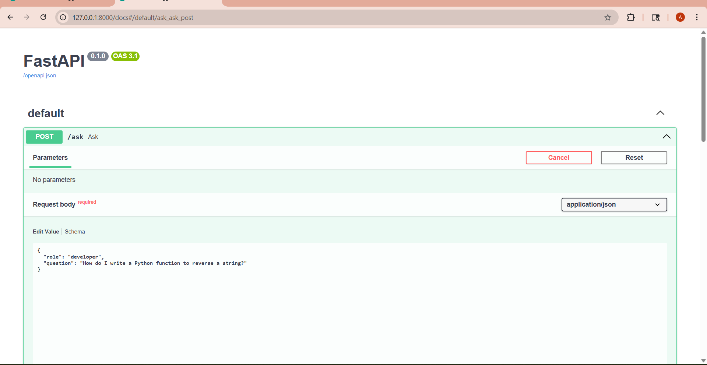
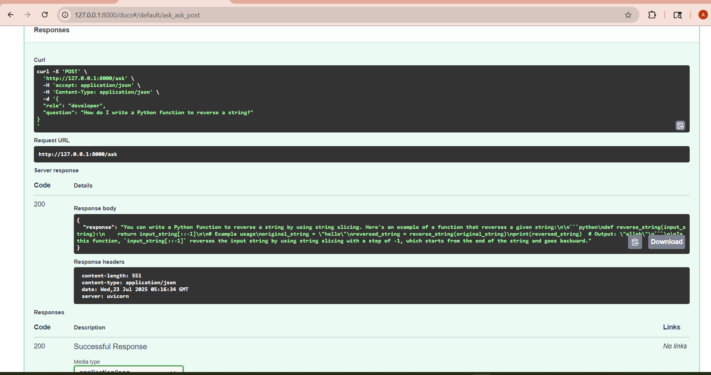

# 🤖 LLM Role-Based Assistant

LLM Role-Based Assistant is a FastAPI-powered application that utilizes OpenAI's API to generate contextually tailored responses based on user roles (e.g., developer, analyst, student, manager). It is ideal for personalized assistance, tutoring, and decision-making support.

---

## 🚀 Features

- Role-specific responses (developer, analyst, student, manager)
- OpenAI API integration
- FastAPI backend
- Environment variable support using `.env`
- Clean Swagger (OpenAPI) documentation

---


## 📸 Screenshots

### 🔹 Swagger Input (Role-based question)


### 🔹 API Response (Role-specific answer)

---

## 📦 Installation

```bash
git clone https://github.com/Ariba-Sameen-Ansari/llm-role-based-assistant.git
cd llm-role-based-assistant
python -m venv venv
venv\Scripts\activate      # On Windows
# or
source venv/bin/activate   # On macOS/Linux

pip install -r requirements.txt
uvicorn main:app --reload
```

## 🔐 Environment Variables
To configure your OpenAI API key securely:

Create a .env file in the root folder.

Add your key like this:

bash
Copy
Edit
OPENAI_API_KEY=your_real_openai_key_here
✅ .env is already added to .gitignore, so your secret stays safe.
✅ A .env.example file is included as a reference.

## 🛠️ Usage
Send a POST request to /ask with a JSON body:

json
Copy
Edit
{
  "role": "developer",
  "question": "How do I write a Python function to reverse a string?"
}
Example via curl:

bash
Copy
Edit
curl -X 'POST' \
  'http://127.0.0.1:8000/ask' \
  -H 'accept: application/json' \
  -H 'Content-Type: application/json' \
  -d '{
  "role": "developer",
  "question": "How do I write a Python function to reverse a string?"
}'

## 📁 File Structure
bash
Copy
Edit
llm-role-based-assistant/
│
├── main.py               # FastAPI entry point
├── role_logic.py         # Role-based response logic
├── .env.example          # Sample env file
├── .gitignore
├── readme.md
└── screenshots/          # Project screenshots

## 🧠 Future Enhancements
Add more roles (e.g., designer, tester)

Integrate JWT authentication

Enable role-based access control

Host on Render or Railway

## 👩‍💻 Author
Ariba Sameen Ansari
GitHub: Ariba-Sameen-Ansari
Email: aribasameen0960@gmail.com

📄 License
This project is open source and available under the [Apache License 2.0](LICENSE)..


---
